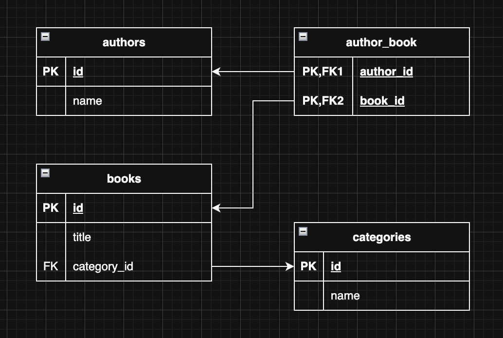

# 📚 Book Database Schema

This project defines a simple relational database designed to manage books, their authors, and their categories. It supports many-to-many relationships between authors and books, and a one-to-many relationship between books and categories.

## 🗂️ Database Diagram

## 📄 Table Descriptions

- **Authors**: Stores information about each author who may have written one or more books.  
- **Books**: Contains details about each book, which can have multiple authors and belongs to one category.  
- **Categories**: Defines the genre or type each book belongs to, with many books per category.  
- **AuthorBook**: A join table that links authors and books to represent their many-to-many relationship.