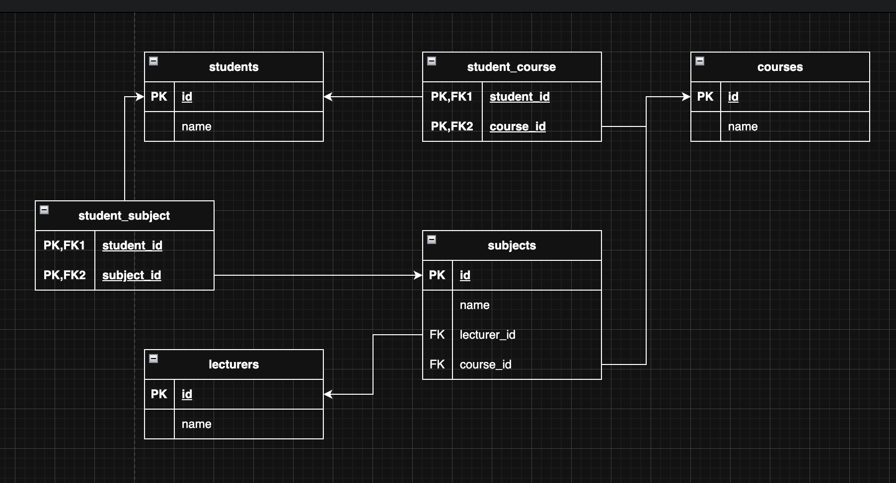

# 📚 My college

## 🗂️ Database Diagram

## 🔗 Relationships

- **Students ↔ Courses**: Many-to-many — students can enroll in multiple courses, and courses can have many students.
- **Students ↔ Subjects**: Many-to-many — students can study multiple subjects, and subjects can be taken by many students.
- **Courses → Subjects**: Many-to-one — each course is linked to a single subject.
- **Subjects → Lecturers**: Many-to-one — each subject is taught by a single lecturer.

## 🧱 Tables and Descriptions

- **Students**: Stores information about each student.
- **Courses**: Represents academic courses that students can enroll in.
- **Subjects**: Academic subjects linked to courses and lecturers.
- **Lecturers**: Stores information about each lecturer.
- **StudentCourse**: Join table representing the many-to-many relationship between students and courses.
- **StudentSubject**: Join table representing the many-to-many relationship between students and subjects.
