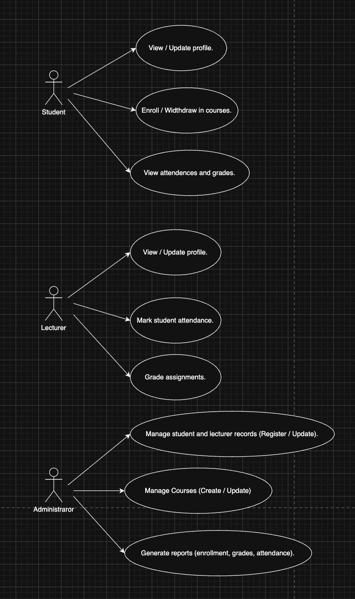
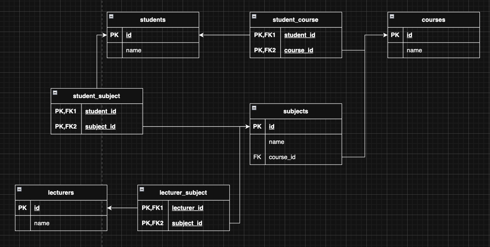

Actors:

1- Student – main user who enrolls in courses and attends classes.

2- Lecturer – teaches courses and manages classes.

3- Administrator – 

Use Cases:

For Student

 - View / Update profile.

 - Enroll / Widthdraw in courses.

 - View attendences and grades.


For Lecturer

- View / Update profile.

- Mark student attendance.

- Grade assignments.


For Administrator (if included)

- Manage student and lecturer records (Register / Update).

- Manage Courses (Create / Update)

- Generate reports (enrollment, grades, attendance).


# Last week senario

# 📚 Yoobee College

## 🗂️ Database Diagram



## 🔗 Relationships

- **Students ↔ Courses**: Many-to-many — students can enroll in multiple courses, and courses can have many students.
- **Students ↔ Subjects**: Many-to-many — students can study multiple subjects, and subjects can be taken by many students.
- **Courses → Subjects**: Many-to-one — each course is linked to a single subject.
- **Lecturers ↔ Subjects**: Many-to-many — lecturers can teach multiple subjects, and subjects can be taken by many lecturers.

## 🧱 Tables and Descriptions

- **Students**: Stores information about each student.
- **Courses**: Represents academic courses that students can enroll in.
- **Subjects**: Academic subjects linked to courses and lecturers.
- **Lecturers**: Stores information about each lecturer.
- **StudentCourse**: Join table representing the many-to-many relationship between students and courses.
- **StudentSubject**: Join table representing the many-to-many relationship between students and subjects.
- **LecturerSubject**: Join table representing the many-to-many relationship between lecturers and subjects.

## 🏀 Usage
### Main menu
```
0. Exit                         : Exit program.
1. Student management           : Enter student management menus.
2. Course management            : Enter course management menus.
3. Lecturer management          : Enter lecturer management menus.
4. Subject management           : Enter subject management menus.
```

### Student management
```
0. back to main menu            : Show main menus.
1. view all students            : Show all students in database.
2. add a student                : Insert new student. (requires: name)
3. delete a student             : Delete a student. (requires: student_id)
4. update a student             : Update a student information. (requires: student_id, name)
5. view student details         : Show a student details including related courses and subjects (require: student_id)
6. enroll a course              : Enroll a student in a new course, which also registers all subjects under that course. (requires: student_id, course_id)
7. withdraw a course            : Withdraw a student from a course, which also unregisters all subjects under that course. (requires: student_id, course_id)
8. withdraw a subject           : Withdraw a subject from student (require: student_id, subject_id)
```

### Course management
```
0. back to main menu            : Show main menus.
1. view all courses             : Show all courses in database
2. add a course                 : Insert new course. (requires: name)
3. delete a course              : Delete a course. (requires: course_id)
4. update a course              : Update a course information. (requires: course_id, name)
```

### Lecturer management
```
0. back to main menu            : Show main menus.
1. view all lecturers           : Show all lecturers in database
2. add a lecturer               : Insert new lecturer. (requires: name)
3. delete a lecturer            : Delete a lecturer. (requires: lecturer_id)
4. update a lecturer            : Update a lecturer information. (requires: lecturer_id, name)
5. view a teacher details       : Show a lecturer details including related subjects (require: lecturer_id)
6. add a subject                : Link a subject to a lecturer (require: lecturer_id)
7. remove a subject             : Unlink a subject to a lecturer (require: lecturer_id)
```

### Subject management
```
0. back to main menu            : Show main menu
1. view all subjects            : Show all subjects in database
2. add a subject                : Insert new subject. (requires: name)
3. delete a subject             : Delete a subject. (requires: subject_id)
4. update a subject             : Update a subject information. (requires: subject_id, name)
```
